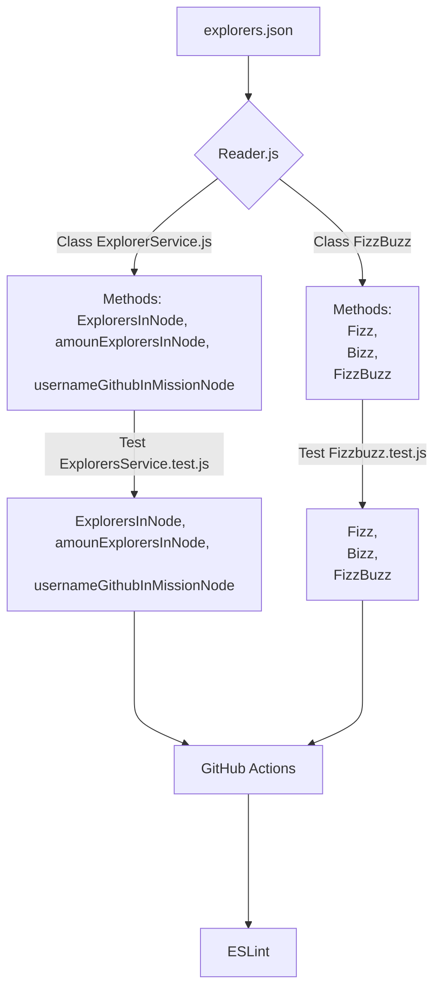

# FizzBuzz
Refactorización, Automatización y Linter de proyecto FizzBuzz

El proyecto FizzBuzz es un ejemplo de como trabajar con código legado y refactorizar el script. 
Tiene GitHub Actions para automatizar las pruebas y una ESLint como guia de estilos.




## REFACTORIZANDO EL PROYECTO
Realizar las clases, los metodos y pruebas de unidad, respecto al código legado para:
- Leer un archivo json
- Filtrar una lista de explorers que esten en la misma mision "node"
- Obtener la cantidad de explorers que estan en una misma mision "node"
- Obtener el **githubUsername** de todos los explorers que esten en una misma mision "node"
- Definir si el **score** de un explorer es **FIZZ**, **BUZZ** o **FIZZBUZZ**

#### Instalar Jest 
  `npm install jest --save-dev jest`
#### Realizar las pruebas necesarias y que sean correctas
  
## GITHUB ACTIONS
Permite automatizar el código. 

#### 1.- Crear el archivo `.github/workflows/test.yml` en el directorio raiz que contenga el siguiente código:

```yml
name: Run Tests in my project every push on GitHub

on: [push]

jobs:
  build:
    runs-on: ubuntu-latest
    steps:
    - uses: actions/checkout@v1
    - name: Run Jest
      uses: stefanoeb/jest-action@1.0.3
```
#### 2.- Guardar los cambios y revisar que las pruebas de GitHub Actions se ejcuten en cada PUSH


## ESLint 
Es una guia de estilos para Java Script

#### 1.- Instar ESLint
`npm install eslin --save-dev`
#### 2.- Ejecutar el siguiente comando para configurar ESLint
`npm init @eslint/config`
#### 3.- Modificar el package.json agregando el siguiente código en la parte de **scripts** debajo de **test**.
```"scripts": {
    "test": "node ./node_modules/.bin/jest",
    "linter": "node ./node_modules/eslint/bin/eslint.js .",
    "linter-fix": "node ./node_modules/eslint/bin/eslint.js . --fix"
  },```

